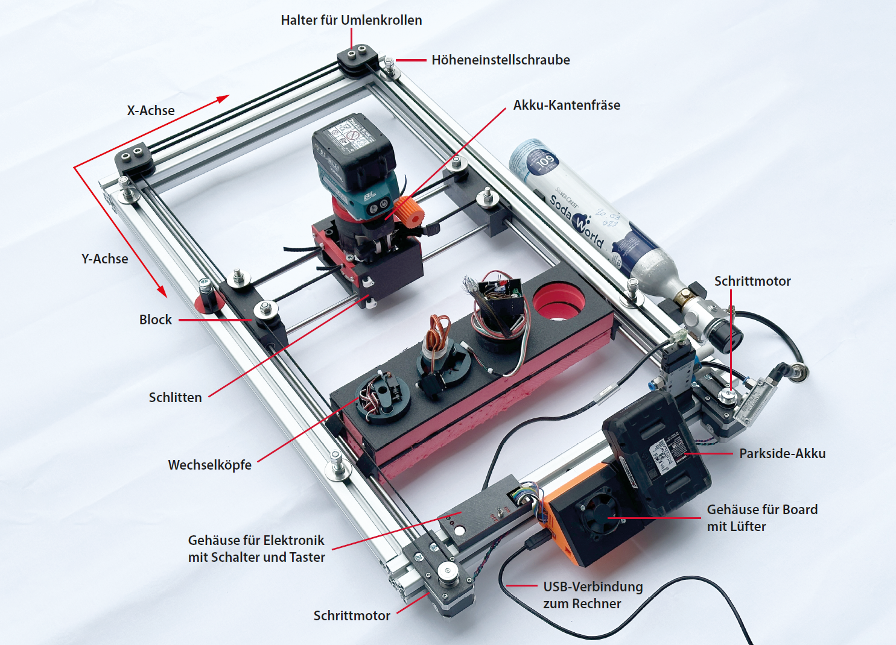
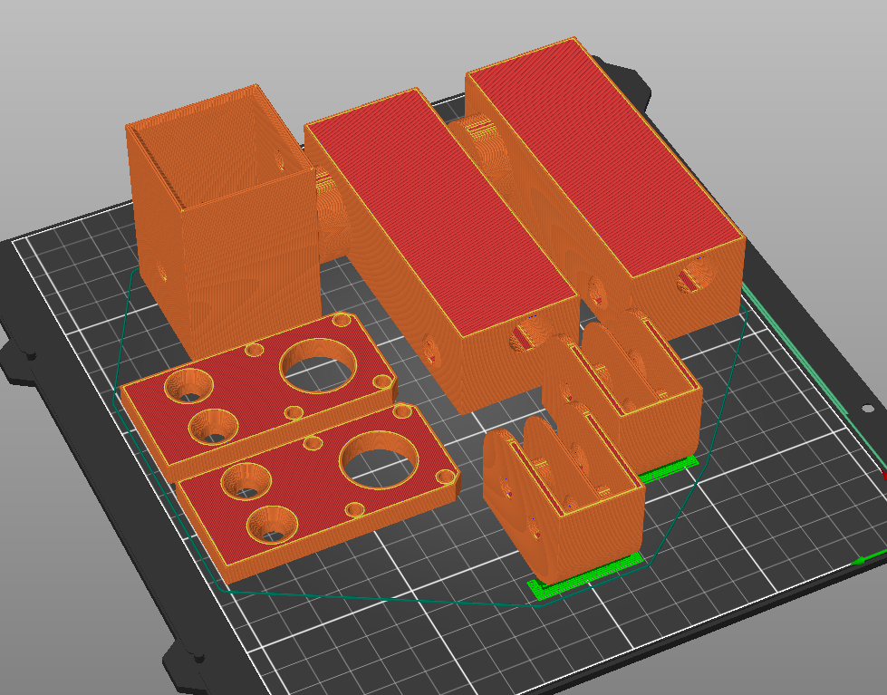
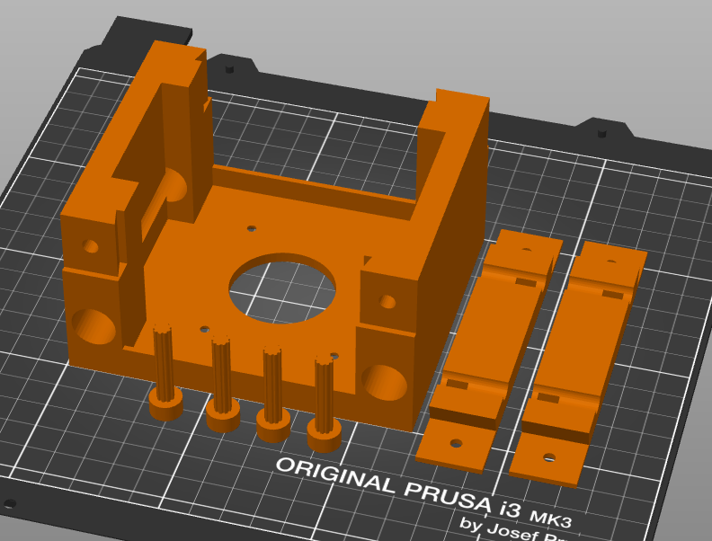
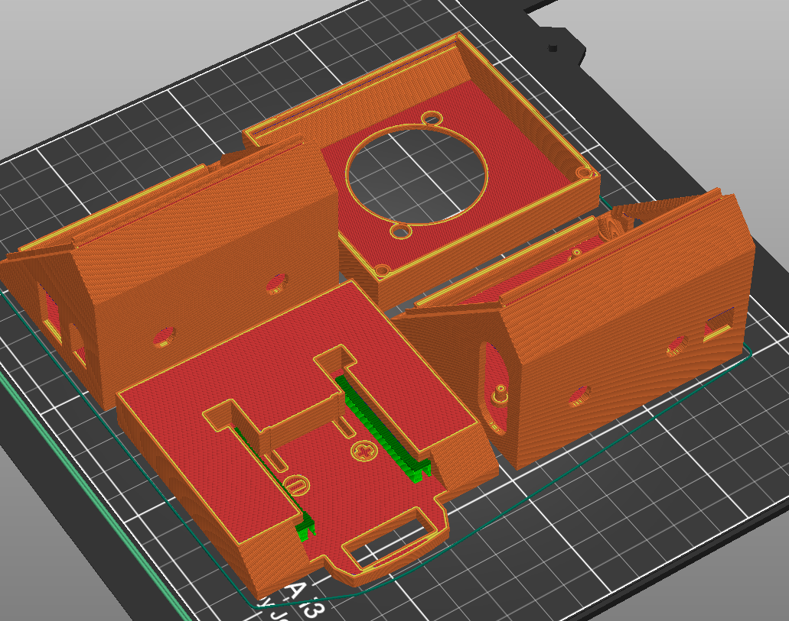
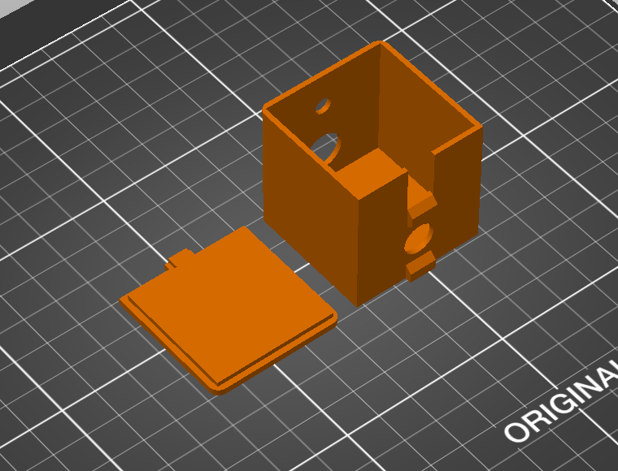
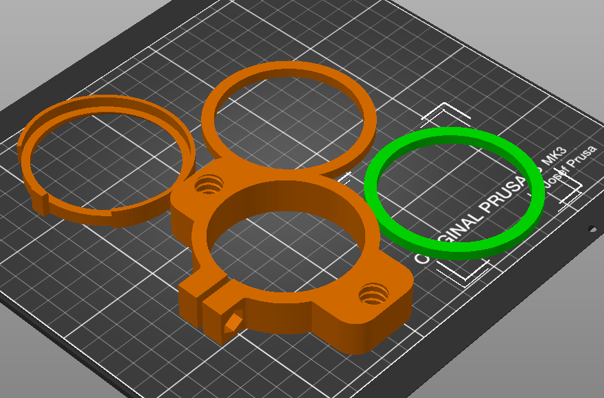
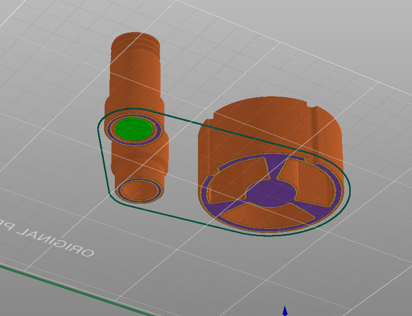

Maker Media GmbH

***

# Mobi-C

## Die mobile CNC-Fräse

**Dieser handliche X-Y-Positionierer für die Oberfräse ist schnell und einfach nachgebaut – dank fertig auf Länge bestellter Alu-Profile und Verbindungsteilen aus dem 3D-Drucker. Das ganze ist leicht zu transportieren, wird komplett mit Akkus betrieben und fräst auch in Werkstücke, die viel größer sind, als der Rahmen selbst.**

Hier gibt es alles rund um den Nachbau der eigenen Mobi-C:

* Im Ordner _[cad](./cad/)_ liegt das 3D-Modell der Mobi-C als STEP-Datei und Projekt für Autodesk-Fusion 
* Im Ordner _[doc](./doc/)_ liegt unter anderem der [Schaltplan](./doc/schema.png)
* Im Ordner _[3d](./3d/)_ liegen die 3D-Druckvorlagen als STL-Dateien und gruppiert als 3mf, Details dazu weiter unten im Abschnitt **3D-Drucke**
* Im Ordner _[src](.src/)_ liegt das AutoHotkey-Skript fürs Einbauen der Pausen in den G-Code und im Zip-Archiv die EXE-Version davon

Der vollständige Artikel zum Projekt steht in der **[Make-Ausgabe 3/24 ab Seite 26](https://www.heise.de/select/make/2024/3/2401616284584453190)**. Einen ergänzenden Artikel mit weiteren Details zur Höhenverstellung, zur Frästiefen-Einstellung, zur Schleppmesser-Erweiterung und ein paar Erfahrungswerten gibt es **[online](https://heise.de/-9718002)**.

# Materialliste und Bezugsquellen
Vor einer Bestellung sind mit Hilfe der Tabelle im Heft und anhand der gewünschten Arbeitsbereichsgröße der eigenen Mobi-C die nötigen Profillängen **X** und **Y** sowie die Gleitstangenlängen **GX** und **GY** zu ermitteln.

* [2 Aluminiumprofile 40×40×**X** mm, Nut 8, M8-Gewinde an den Stirnseiten anbringen lassen](https://www.dold-mechatronik.de/Aluminiumprofil-40x40L-I-Typ-Nut-8-leicht-176kg-m-Zuschnitt-50-6000mm)
* [2 Aluminiumprofile 40×40×**Y** mm, Nut 8](https://www.dold-mechatronik.de/Aluminiumprofil-40x40L-I-Typ-Nut-8-leicht-176kg-m-Zuschnitt-50-6000mm)
* [2 Präzisionswellen 8×**GX**, geschliffen und gehärtet](https://www.dold-mechatronik.de/Praezisionswelle-8mm-h6-geschliffen-und-gehaertet-Material-CF53-mit-Bearbeitung)
* [2 Präzisionswellen 8×**GY**, geschliffen und gehärtet](https://www.dold-mechatronik.de/Praezisionswelle-8mm-h6-geschliffen-und-gehaertet-Material-CF53-mit-Bearbeitung)
* [Zahnriemen GT2, 6 mm, Länge laut Tabelle im Heft](https://www.dold-mechatronik.de/Zahnriemen-GT2-Breite-6mm-Meterware-Laenge-6-Meter)
* [5 Nutensteine mit Steg I-Typ 8 mit M8-Gewinde](https://www.dold-mechatronik.de/Nutenstein-mit-Steg-I-Typ-Nut-8-Gewindedurchmesser-M8)
* [7 Nutensteine mit Steg I-Typ 8 mit M6 Gewinde](https://www.dold-mechatronik.de/Nutenstein-mit-Steg-I-Typ-Nut-8-Gewindedurchmesser-M6)
* [4 Zylinderschrauben DIN 912 M8×40 (Innensechskant) für die Umlenkrollen am Rahmen](https://www.dold-mechatronik.de/DIN-912-Zylinderschraube-mit-Innensechskant-88-verzinkt-M8x40)
* [4 Zylinderschrauben DIN 912 M8×60 (Innensechskant) für die Umlenkrollen der X-Achse](https://www.dold-mechatronik.de/DIN-912-Zylinderschraube-mit-Innensechskant-88-verzinkt-M8x60)
* [4 DIN 7984 Zylinderschraube mit Innensechskant und niedrigem Kopf für die Rahmenmontage](https://www.dold-mechatronik.de/DIN-7984-Zylinderschraube-mit-Innensechskant-und-niedrigem-Kopf-88-verzinkt-M8x16)
* [4 Scheiben DIN9021 M8 - 8.4×32](https://www.dold-mechatronik.de/Scheibe-DIN9021-M8-84X32X2-A2)
* [4 Scheiben DIN125A-84 × M8](https://www.dold-mechatronik.de/Scheibe-DIN125A-M8x84-A2)
* [8 Kugellager 608ZZ (8×22×7)](https://www.dold-mechatronik.de/608ZZ-Bearings-8-x-22-x-7)
* [2 Z30-GT2-6 Riemenscheiben 5 mm Bohrung, 16 mm Sitz](https://www.bastelgarage.ch/z30-gt2-6-riemenscheibe-5mm-bohrung-16mm-sitz?search=z30-gt2)
* [8 Gleitlager LM8UU (8 mm Welle, 15×24 mm)](https://www.dold-mechatronik.de/Linearlager-8mm-LM8UU)
* 1 Meter Gewindestange M8 oder drei Schrauben M8, 100 mm lang mit Vollgewinde für die Höhenverstellung
* [4 Gewindeeinsätze M4](https://www.reichelt.com/ch/de/3d-druck-gewindeeinsaetze-m4x8-1-50-stueck-rx-m4x8-1-p332215.html?PROVID=2808&gad_source=1&gclid=CjwKCAiAxaCvBhBaEiwAvsLmWL-SdI0Midrz6Xop66Bk-TptqZBAu-bS2fUa_IQvAQy3a88Up4D5PxoCIvAQAvD_BwE)
* 4 selbstsichernde Muttern M8
* 2 Stepper-Motoren (ST42sth38-1684A)
* [Arduino Uno USB](https://www.reichelt.com/ch/de/arduino-uno-rev-3-smd-variante-atmega328-usb-arduino-uno-p119045.html?search=arduino+uno&&r=1)
* [CNC-Shield mit 4 Treibern A4988](https://www.reichelt.com/ch/de/arduino-shield-cnc-controllerboard-a4988-ard-shd-cnc-kit-p226375.html?&trstct=pos_0&nbc=1)
* Lüfter 40×40×20 mm 12 bis 24 Volt
* 2 Schalter
* 1 Taster 
* 2 LEDs (eine rote, eine grüne)
* 2 Büroklammern
* [Parkside-Akku und Ladegerät](https://www.lidl.de/p/parkside-20-v-akku-2-ah-pap-20-b1-und-ladegeraet-2-4-a-plg-20-c1/p100368935)

# 3D-Drucke

 Als Material für alle 3D-Druck-Teile hat sich PLA bewährt, bei 0,2  Millimetern Schichtdicke. Als Infill reichen 15 %, außer bei den  Motorhaltern, die brauchen 80 %. Folgende Bilder zeigen, wie die Teile auf der Druckplatte angeordnet und orientiert werden sollten. Support ist nur an wenigen Stellen nötig: unter den Rundungen der Umlenkrollengehäuse  sowie beim Parkland-Akku-Adapter, auf den Screenshots.  

1. Hier alle Teile für den Rahmen, grün erkennt man den Support unter den Rundungen der Umlenkrollengehäuse:

2. Die Teile für den Schlitten werden nicht gestützt: 

3. Bei den Elektronikgehäusen muss der Adapter für den Parkside-Akku gestützt werden (vorne links):

4. Das Schaltergehäuse braucht keine Stützen: 
   

5. Auch die Teile für die Makita müssen nicht gestützt werden:
   

6. Die Ansicht für die Teile des Schleppmesseradapters sind hier der Deutlichkeit halber von schräg unten zu sehen: Grün bedeutet Support, die violette Fläche ist das erste Drucklayer:
   

   
